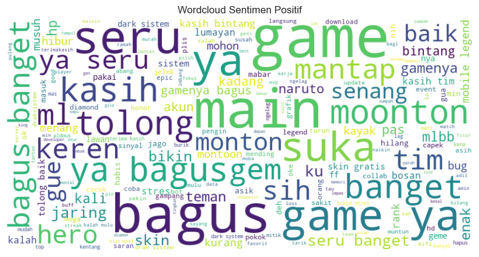
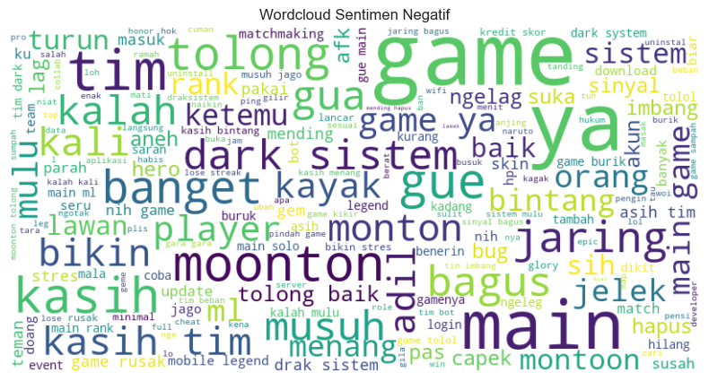
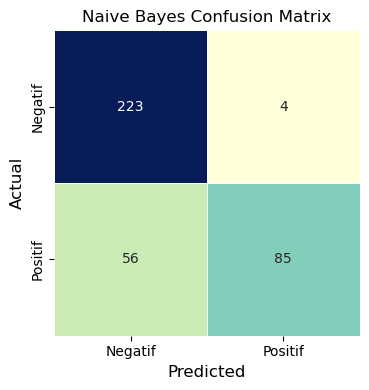
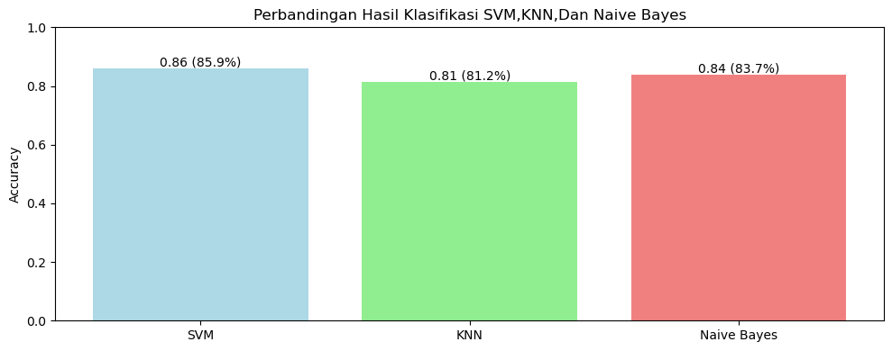

<div align="center">

# 🎮 Sentiment Analysis of Mobile Legends Game Reviews


*Classifying user sentiment from 1,840 Google Play Store reviews using a full NLP pipeline and multi-model comparison — built for Indonesian-language text.*

</div>

---

## 📌 Project Overview

Analyzed **1,840 Google Play Store reviews** of the Mobile Legends game to classify user sentiment using machine learning. The project covers a full NLP pipeline from raw text preprocessing to multi-model comparison, identifying the best-performing classifier for **Indonesian-language sentiment classification**.

**Research Questions:**
- What is the overall sentiment distribution of Mobile Legends reviews on Google Play Store?
- Which machine learning algorithm performs best for Indonesian-language sentiment classification?
- What are the most frequently mentioned words in positive and negative reviews?
- How effectively can rating-based labeling represent actual user sentiment?

---

## 🛠️ Tools Used

| Tool | Purpose |
|---|---|
| Python | Core programming language |
| Pandas, NumPy | Data loading and manipulation |
| NLTK | Tokenization & Indonesian stopword removal |
| Sastrawi | Indonesian stemming library |
| Scikit-learn | ML models, TF-IDF vectorization, evaluation |
| WordCloud | Word frequency visualization |
| Matplotlib & Seaborn | Plotting and visualization |

---

## 📁 Repository Structure

```
sentiment-analysis-mobile-legends/
│
├── 📓 notebook/
│   └── sentiment_analysis.ipynb          # Full NLP pipeline & modeling
│
├── 📊 data/
│   ├── raw_reviews.csv                   # Original 1,840 reviews
│   └── cleaned_reviews.csv               # Preprocessed dataset
│
├── 📈 results/
│   ├── wordcloud_positive.png            # WordCloud — positive sentiment
│   ├── wordcloud_negative.png            # WordCloud — negative sentiment
│   ├── confusion_matrix_nb.png           # Confusion Matrix — Naive Bayes
│   └── model_comparison.png             # Accuracy comparison all 3 models
│
└── README.md
```

---

## 🔧 Data Preparation

1. **Loaded** 1,840 Google Play Store reviews (date, username, rating, review text)
2. **Removed duplicates** based on review text to ensure data quality
3. **Full NLP Preprocessing Pipeline:**

```
Raw Text
   ↓ URL & HTML removal
   ↓ Emoji removal
   ↓ Symbol & number stripping
   ↓ Case folding (lowercase)
   ↓ Word normalization (custom Indonesian slang dictionary)
   ↓ Tokenization
   ↓ Stopword removal (NLTK Indonesian)
   ↓ Stemming (Sastrawi)
Clean Tokens
```

4. **Sentiment labeling** based on rating:
   - Rating ≤ 3 → **Negative** 😠
   - Rating > 3 → **Positive** 😊

5. **Train/Test split:** 80% train / 20% test using **stratified sampling** + **TF-IDF vectorization**

---

## 🤖 Modelling

Trained and compared **3 classification models:**

| Model | Description |
|---|---|
| Support Vector Machine (SVM) | Finds optimal hyperplane to separate sentiment classes |
| K-Nearest Neighbor (KNN) | Classifies based on nearest neighbors in TF-IDF space |
| Multinomial Naive Bayes | Probabilistic model well-suited for sparse text features |

**Evaluation metrics:** Accuracy, Precision, Recall, F1-Score, Confusion Matrix

---

## 📸 Results & Visualizations

### ☁️ WordCloud — Positive Sentiment


### ☁️ WordCloud — Negative Sentiment


### 🔢 Confusion Matrix — Multinomial Naive Bayes (Best Model)


### 📊 Model Comparison — Accuracy All 3 Algorithms


---

## 💡 Key Insights

| Finding | Detail |
|---|---|
| 🏆 Best Model | **Multinomial Naive Bayes** — 83.4% accuracy |
| 😊 Sentiment Distribution | Positive sentiment dominated — overall favorable user reception |
| 😠 Negative Keywords | Gameplay issues, technical complaints, bugs |
| 😊 Positive Keywords | Fun, engaging gameplay, enjoyable experience |
| 📐 Why Naive Bayes Wins | Highly efficient on sparse TF-IDF features; outperforms SVM & KNN on this dataset |

---

## ✅ Recommendations

- 🥇 **Multinomial Naive Bayes** is recommended as the baseline model for Indonesian-language app review sentiment classification due to its efficiency and strong performance on sparse TF-IDF features
- 🔮 **Future work:** Explore deep learning approaches such as **IndoBERT** for improved contextual understanding of informal Indonesian text

---

## 🚀 How to Run

```bash
git clone https://github.com/rafihanif30/sentiment-analysis-mobile-legends.git
cd sentiment-analysis-mobile-legends
pip install pandas numpy nltk scikit-learn sastrawi wordcloud matplotlib seaborn

# Download NLTK stopwords
python -c "import nltk; nltk.download('stopwords')"

jupyter notebook notebook/sentiment_analysis.ipynb
```

---

<div align="center">

## 👤 Author

**Rafi Hanifa Fikri**
📧 rafihanifafikri30@gmail.com
🎓 Information Systems — Gunadarma University

---

*If you found this helpful, please consider giving a ⭐ to this repository!*

</div>
